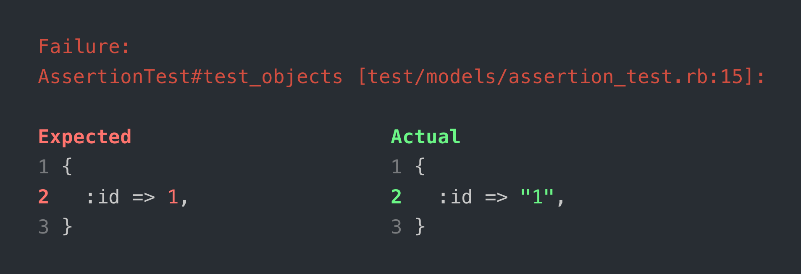

# Minitest::Difftastic

A Minitest Plugin which uses [`difftastic`](https://github.com/Wilfred/difftastic) (via [`difftastic-ruby`](https://github.com/joeldrapper/difftastic-ruby)) to show the diffs for failing assertions.

Also works for Rails tests using `ActiveSupport::TestCase`.

### Integers


### Strings


### Objects



### Nested Objects


## Installation

Install the gem and add to the application's Gemfile `test` group by executing:

```shell
bundle add minitest-difftastic --group=test
```

If bundler is not being used to manage dependencies, install the gem by executing:

```shell
gem install minitest-difftastic
```

## Usage

The plugin will be automatically detected and picked up by Minitest if you have it added to the Gemfile of your application.

## Development

After checking out the repo, run `bin/setup` to install dependencies. Then, run `rake test` to run the tests. You can also run `bin/console` for an interactive prompt that will allow you to experiment.

To install this gem onto your local machine, run `bundle exec rake install`. To release a new version, update the version number in `version.rb`, and then run `bundle exec rake release`, which will create a git tag for the version, push git commits and the created tag, and push the `.gem` file to [rubygems.org](https://rubygems.org).

## Contributing

Bug reports and pull requests are welcome on GitHub at https://github.com/marcoroth/minitest-difftastic. This project is intended to be a safe, welcoming space for collaboration, and contributors are expected to adhere to the [code of conduct](https://github.com/marcoroth/minitest-difftastic/blob/main/CODE_OF_CONDUCT.md).

## Code of Conduct

Everyone interacting in the `Minitest::Difftastic` project's codebases, issue trackers, chat rooms and mailing lists is expected to follow the [code of conduct](https://github.com/marcoroth/minitest-difftastic/blob/main/CODE_OF_CONDUCT.md).
